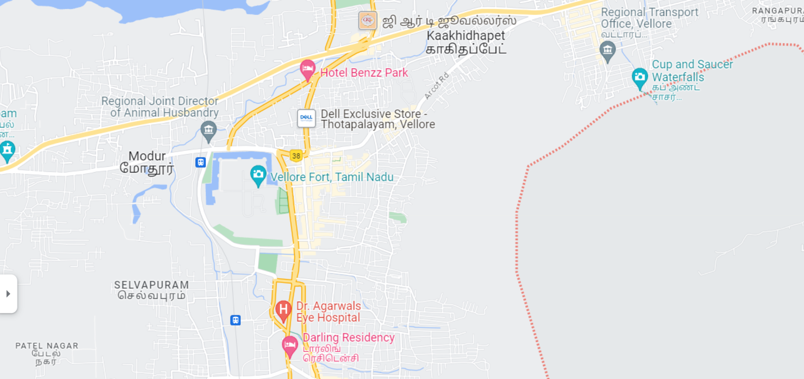
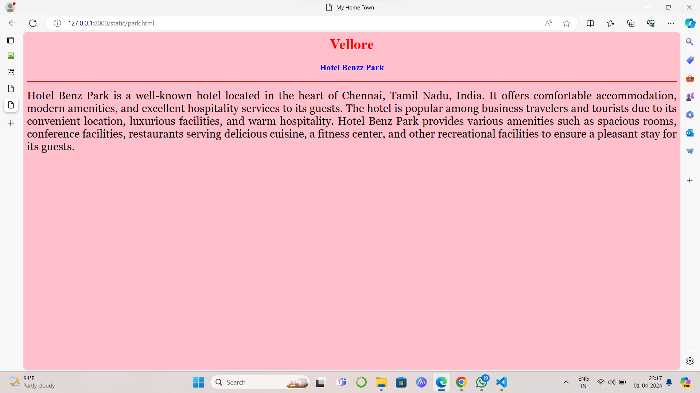
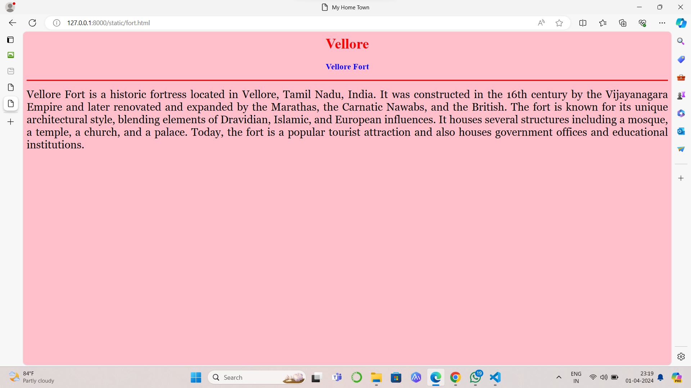
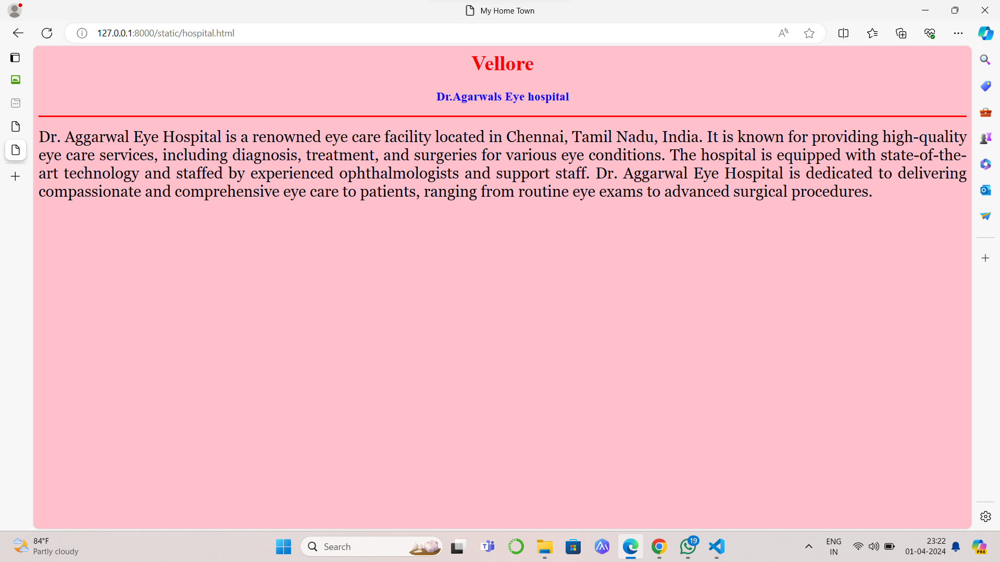
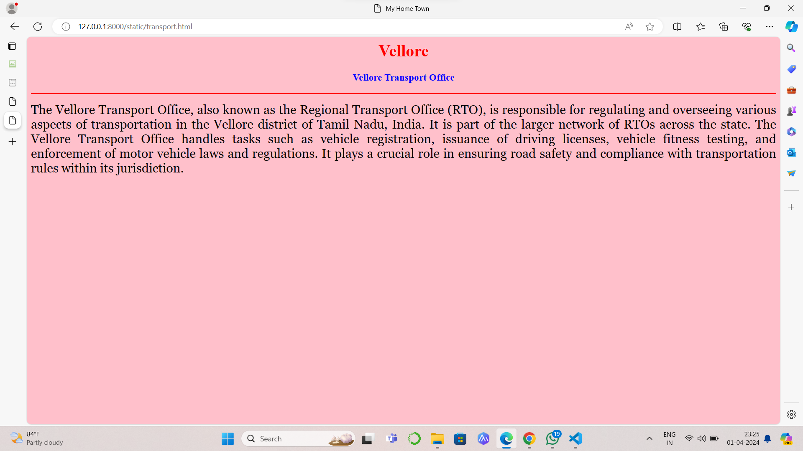
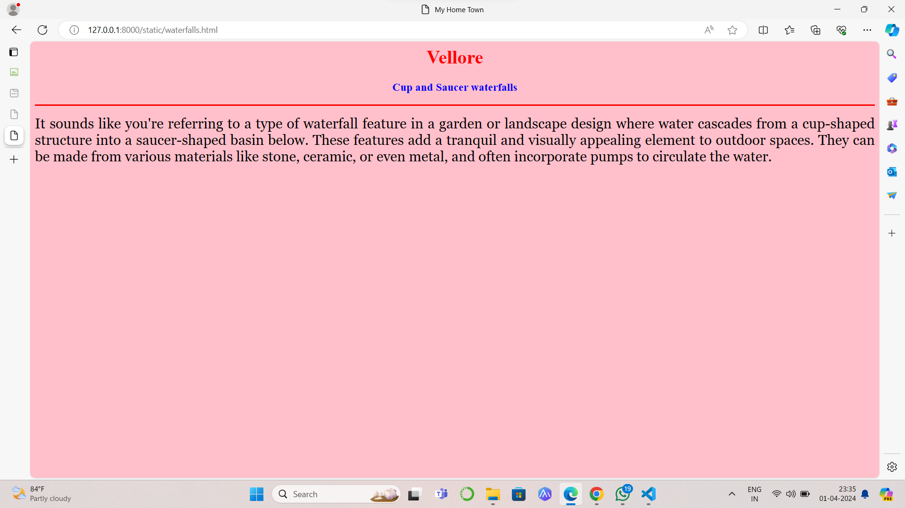

# Ex04 Places Around Me
## Date: 01.04.2024

## AIM
To develop a website to display details about the places around my house.

## DESIGN STEPS

### STEP 1
Create a Django admin interface.

### STEP 2
Download your city map from Google.

### STEP 3
Using ```<map>``` tag name the map.

### STEP 4
Create clickable regions in the image using ```<area>``` tag.

### STEP 5
Write HTML programs for all the regions identified.

### STEP 6
Execute the programs and publish them.

## CODE
```
map.html
<html>
<head>
<title>My City</title>
</head>
<body>
<h1 align="center">
<font color="red"><b>Vellore</b></font>
</h1>
<h3 align="center">
<font color="blue"><b>Dhivya Regno(212223230050)</b></font></h3>
<center>

<map name="MyCity">
<area shape="rect" coords="640,386,900,450" href="transport.html" title="Vellore Transport Office">
<area shape="rect" coords="725,137,999,211" href="waterfalls.html" title="Cup and Saucer waterfalls">
<area shape="rect" coords="644,385,912,459" href="hospital.html" title="Dr.Agarwals Eye hospital">
<area shape="rect" coords="644,384,915,458" href="fort.html" title="Vellore Fort">
<area shape="rect" coords="727,136,998,210" href="park.html" title="Hotel Benzz Park">
</map>
</center>
</body>
</html>

hospital.html

<html>

<head>

<title>My Home Town</title>

</head>

<body bgcolor="pink">

<h1 align="center">

<font color="red"><b>Vellore</b></font>

</h1>

<h3 align="center">

<font color="blue"><b>Dr.Agarwals Eye hospital</b></font>

</h3>

<hr size="3" color="red">

<p align="justify">

<font face="Georgia" size="5">
    Dr. Aggarwal Eye Hospital is a renowned eye care facility located in Chennai, Tamil Nadu, India. It is known for providing high-quality eye care services, including diagnosis, treatment, and surgeries for various eye conditions. The hospital is equipped with state-of-the-art technology and staffed by experienced ophthalmologists and support staff. Dr. Aggarwal Eye Hospital is dedicated to delivering compassionate and comprehensive eye care to patients, ranging from routine eye exams to advanced surgical procedures.
</p>

</body>

</html>

park.html

<html>

<head>

<title>My Home Town</title>

</head>

<body bgcolor="pink">

<h1 align="center">

<font color="red"><b>Vellore</b></font>

</h1>

<h3 align="center">

<font color="blue"><b>Hotel Benzz Park</b></font>

</h3>

<hr size="3" color="red">

<p align="justify">

<font face="Georgia" size="5">
    Hotel Benz Park is a well-known hotel located in the heart of Chennai, Tamil Nadu, India. It offers comfortable accommodation, modern amenities, and excellent hospitality services to its guests. The hotel is popular among business travelers and tourists due to its convenient location, luxurious facilities, and warm hospitality. Hotel Benz Park provides various amenities such as spacious rooms, conference facilities, restaurants serving delicious cuisine, a fitness center, and other recreational facilities to ensure a pleasant stay for its guests.
</p>

</body>

</html>

fort.html

<html>

<head>

<title>My Home Town</title>

</head>

<body bgcolor="pink">

<h1 align="center">

<font color="red"><b>Vellore</b></font>

</h1>

<h3 align="center">

<font color="blue"><b>Vellore Fort</b></font>

</h3>

<hr size="3" color="red">

<p align="justify">

<font face="Georgia" size="5">
    Vellore Fort is a historic fortress located in Vellore, Tamil Nadu, India. It was constructed in the 16th century by the Vijayanagara Empire and later renovated and expanded by the Marathas, the Carnatic Nawabs, and the British. The fort is known for its unique architectural style, blending elements of Dravidian, Islamic, and European influences. It houses several structures including a mosque, a temple, a church, and a palace. Today, the fort is a popular tourist attraction and also houses government offices and educational institutions.
    
</p>

</body>

</html>

waterfalls.html

<html>

<head>

<title>My Home Town</title>

</head>

<body bgcolor="pink">

<h1 align="center">

<font color="red"><b>Vellore</b></font>

</h1>

<h3 align="center">

<font color="blue"><b>Cup and Saucer waterfalls</b></font>

</h3>

<hr size="3" color="red">

<p align="justify">

<font face="Georgia" size="5">
    It sounds like you're referring to a type of waterfall feature in a garden or landscape design where water cascades from a cup-shaped structure into a saucer-shaped basin below. These features add a tranquil and visually appealing element to outdoor spaces. They can be made from various materials like stone, ceramic, or even metal, and often incorporate pumps to circulate the water.
</p>

</body>

</html>

transport.html

<html>

<head>

<title>My Home Town</title>

</head>

<body bgcolor="pink">

<h1 align="center">

<font color="red"><b>Vellore</b></font>

</h1>

<h3 align="center">

<font color="blue"><b>Vellore Transport Office</b></font>

</h3>

<hr size="3" color="red">

<p align="justify">

<font face="Georgia" size="5">
    The Vellore Transport Office, also known as the Regional Transport Office (RTO), is responsible for regulating and overseeing various aspects of transportation in the Vellore district of Tamil Nadu, India. It is part of the larger network of RTOs across the state. The Vellore Transport Office handles tasks such as vehicle registration, issuance of driving licenses, vehicle fitness testing, and enforcement of motor vehicle laws and regulations. It plays a crucial role in ensuring road safety and compliance with transportation rules within its jurisdiction.
</p>

</body>

</html>
```


## OUTPUT







## RESULT
The program for implementing image maps using HTML is executed successfully.
